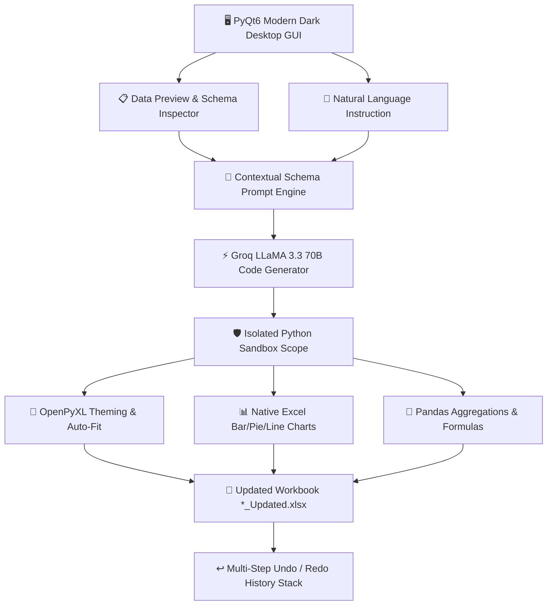

<div align="center">

# 📊 ExcelArchitect — AI Spreadsheet Co-Pilot

**A desktop spreadsheet engineering application combining PyQt6, Pandas, OpenPyXL, and Groq LLMs for natural-language Excel transformations.**

[](https://python.org)
[](https://riverbankcomputing.com/software/pyqt/)
[](https://groq.com/)
[](https://pandas.pydata.org/)
[](LICENSE)

<p align="center">
  <a href="#-overview">Overview</a> •
  <a href="#-architecture">Architecture</a> •
  <a href="#-key-features">Key Features</a> •
  <a href="#-quick-start">Quick Start</a> •
  <a href="#-example-prompts">Example Prompts</a>
</p>

---

</div>

## 📌 Overview

**ExcelArchitect** bridges natural language and complex spreadsheet mutations. Powered by Groq's high-speed inference engine (`llama-3.3-70b-versatile`), it generates strictly scoped Python and OpenPyXL code executed inside an isolated sandbox environment, featuring automatic styling, chart generation, live schema inspection, and multi-step state undo/redo.

---

## 🏗️ Architecture



---

## ✨ Key Features

| Feature | Description |
| :--- | :--- |
| 🗣️ **Natural Language Commands** | Perform calculations, data cleaning, filtering, and cell styling using plain English instructions. |
| 🎨 **Automated OpenPyXL Styling** | Generate custom header themes, alternating row stripes, conditional formatting rules, and auto-fit widths. |
| 📈 **Native Chart Generation** | Embed Excel BarCharts, PieCharts, and LineCharts linked directly to summary datasets. |
| ↩️ **Multi-Step Undo Stack** | Snapshot-based history manager allows seamless one-click rollbacks to previous workbook states. |
| 🔍 **Live Schema Inspector** | Real-time summary displaying row counts, column types, null counts, and distinct value cardinality. |

---

## ⚙️ Quick Start

### 1. Clone & Set Up Environment
```bash
git clone https://github.com/MaharabTimon/ExcelArchitect.git
cd ExcelArchitect
python -m venv venv
venv\Scripts\activate  # Windows
```

### 2. Install Dependencies
```bash
pip install -r requirements.txt
```

### 3. Configure API Key
Create a `.env` file or provide your key when prompted in the GUI on first launch:
```env
GROQ_API_KEY=gsk_your_groq_api_key_here
```

### 4. Launch the App
```bash
python app.py
```

---

## 💡 Example Prompts

- *"Format headers dark navy with white bold text, freeze the top row, and auto-fit all column widths."*
- *"Remove duplicate rows based on Customer ID and highlight values over 5000 in green."*
- *"Group by Department, sum the Salary column, and insert a Bar Chart in column E."*
- *"Add alternating light-blue zebra striping across all data rows."*

---

## 📄 License
This project is open-source and licensed under the [MIT License](LICENSE).
